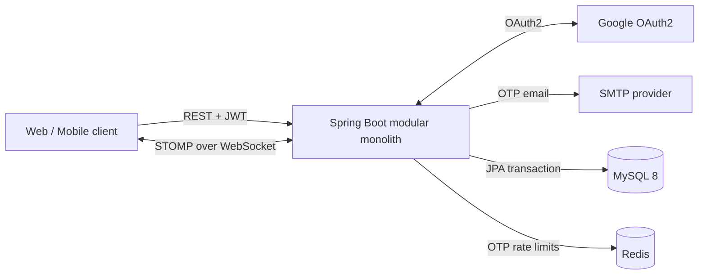
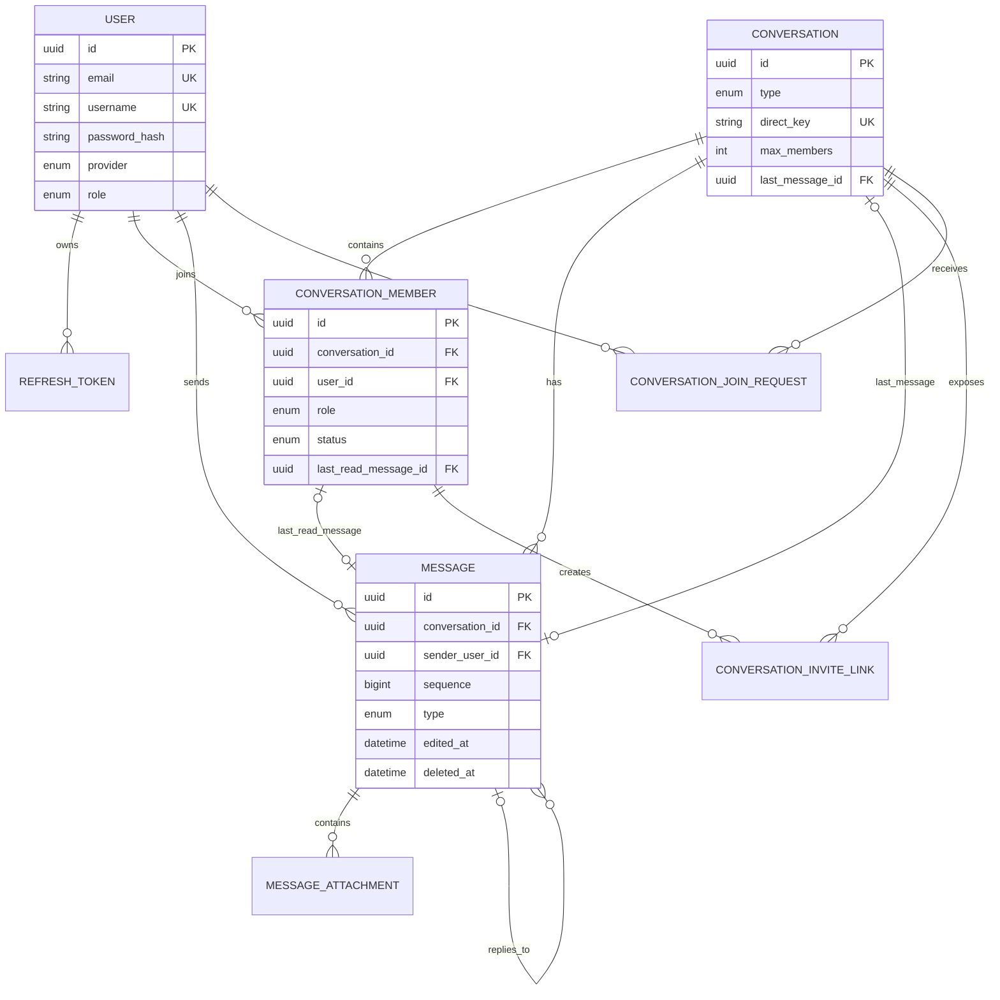
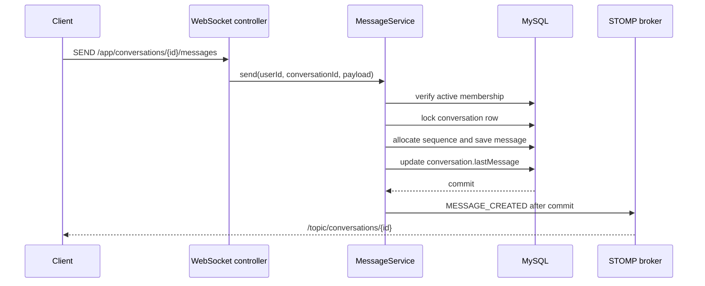

# Kiến trúc hệ thống

## 1. Mục tiêu

Realtime Chat Server là một **modular monolith**: toàn bộ nghiệp vụ được đóng gói và
deploy dưới dạng một Spring Boot application. MySQL lưu dữ liệu bền vững, Redis phục
vụ rate limiting OTP, còn STOMP simple broker xử lý realtime trong cùng process.

Thiết kế này phù hợp với MVP và portfolio vì dễ chạy, dễ debug, transaction nhất quán
và không tạo chi phí vận hành của hệ phân tán. Dự án không giả lập microservice bằng
cách tách package hoặc container ứng dụng một cách không cần thiết.

## 2. System context

Chỉ service `app` chứa business logic và được deploy một lần. MySQL/Redis là hạ tầng
dữ liệu, không phải các business microservice.

## 3. Cấu trúc source

| Package | Trách nhiệm |
| --- | --- |
| `controller` | REST endpoints và STOMP message mappings |
| `service` | Use case, transaction boundary, authorization cấp tài nguyên |
| `repository` | JPA query và locking |
| `entity` | Domain state, relationship và database constraints |
| `dto` | Request validation và response contract; không trả entity trực tiếp |
| `security` | JWT, OAuth2 và user principal |
| `config` | HTTP security, JPA, OpenAPI và WebSocket broker |
| `exception` | Chuẩn hóa lỗi REST |

Các module nghiệp vụ hiện có: Identity & Access, User Profile, Conversation,
Membership/Invitation và Messaging. Chúng nằm trong cùng codebase và cùng database
transaction nhưng được tách trách nhiệm rõ ràng.

## 4. Data model

### Các invariant chính

- Một user chỉ có một membership record trong mỗi conversation; rời nhóm rồi tham
  gia lại sẽ reactivate record cũ.
- Chat riêng có `direct_key` được chuẩn hóa từ hai UUID và unique, ngăn tạo hai phòng
  trùng nhau.
- `message.sequence` unique trong conversation, giúp cursor pagination và read receipt
  ổn định.
- Chỉ group có OWNER/ADMIN. OWNER phải chuyển quyền trước khi rời nhóm.
- Message, user và conversation hỗ trợ soft delete bằng `deletedAt`.

## 5. Luồng gửi tin realtime

Conversation row được khóa pessimistic khi cấp sequence. Unique constraint
`(conversation_id, sequence)` là lớp bảo vệ cuối cùng. Event chỉ phát sau khi
transaction commit để client không nhận một message sau đó bị rollback.

## 6. Security model

- Access token HS256 dùng cho REST resource server và WebSocket CONNECT.
- Refresh token có key riêng, chỉ lưu SHA-256 hash trong database và rotate sau mỗi
  lần sử dụng. Reuse detection thu hồi toàn bộ token family.
- WebSocket CONNECT yêu cầu native header `Authorization: Bearer ...`.
- SUBSCRIBE `/topic/conversations/{id}` kiểm tra membership ACTIVE; biết UUID topic
  không đồng nghĩa có quyền nghe dữ liệu.
- Service kiểm tra quyền lại ở mọi write operation: WebSocket interceptor không thay
  thế business authorization.
- OTP register/reset có rate limit theo email/IP trong Redis.
- Secret chỉ đọc qua environment; JWT secret không được ghi log.

## 7. Lựa chọn và giới hạn

Simple broker là lựa chọn có chủ ý cho một monolith instance. Khi cần chạy nhiều
instance, có thể thay bằng broker relay (RabbitMQ) và shared presence mà không tách
business service. File attachment hiện nhận URL/metadata; binary nên được upload trực
tiếp lên object storage bằng pre-signed URL để application không trở thành file server.

Các chức năng chưa thuộc MVP: reaction, pin/search full-text, push notification,
voice/video call và end-to-end encryption. Chúng được ghi trong roadmap thay vì thêm
code nửa vời.
