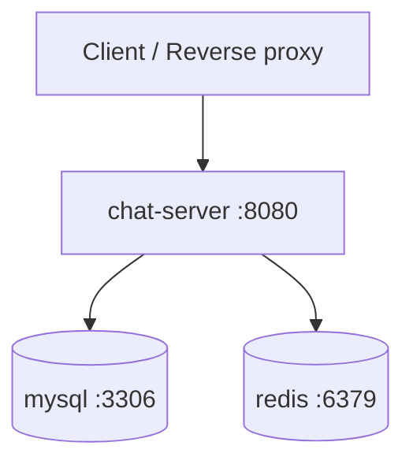

# Local containerization reference

This document covers local Docker packaging and execution only.

## Topology

Môi trường local gồm ba container:



Chỉ `chat-server` là application. MySQL và Redis là dependency hạ tầng; topology này
không phải microservice architecture.

## Chạy bằng Docker Compose

Tạo `.env` từ `.env.example`, thay toàn bộ secret mặc định, sau đó:

```bash
docker compose up --build -d
docker compose ps
curl http://localhost:8080/actuator/health
```

Dừng application nhưng giữ dữ liệu:

```bash
docker compose down
```

MySQL và Redis dùng named volume `mysql-data`, `redis-data`. Không dùng
`docker compose down -v` nếu cần giữ dữ liệu.

## Environment variables

| Biến | Bắt buộc | Ý nghĩa |
| --- | --- | --- |
| `DB_URL` | Có | JDBC URL MySQL |
| `DB_USERNAME` / `DB_PASSWORD` | Có | Database credential |
| `JWT_ACCESS_KEY` | Có | HS256 secret cho access token, tối thiểu 32 random bytes |
| `JWT_REFRESH_KEY` | Có | Secret riêng cho refresh token |
| `MAIL_USERNAME` / `MAIL_PASSWORD` | Có khi dùng OTP | SMTP credential |
| `GG_CLIENT_ID` / `GG_CLIENT_SECRET` | Có khi dùng Google login | OAuth2 credential |
| `OAUTH2_REDIRECT_URI` | Có | Frontend callback URL |
| `CORS_ALLOWED_ORIGINS` | Có | Danh sách frontend origin, phân cách bằng dấu phẩy |
| `JPA_DDL_AUTO` | Không | Mặc định `update` cho môi trường local |
| `APP_PORT` | Không | Host port, mặc định 8080 |

Không commit `.env`. `.env.example` chỉ chứa placeholder.

## CI

`.github/workflows/ci.yml` chạy Java 21 và Maven tests cho push/PR. Test dùng H2
in-memory nên không phụ thuộc database trên runner. MySQL vẫn là database runtime và
context/query compatibility được kiểm tra lại khi chạy integration environment.

## Scale mà vẫn giữ monolith

MVP tối ưu cho một application instance. Nếu traffic tăng:

1. Tối ưu index/query và connection pool.
2. Chuyển file binary sang object storage/CDN.
3. Thay STOMP simple broker bằng broker relay và lưu presence dùng chung khi chạy
   nhiều app instance.
4. Scale nhiều replica của **cùng monolith** sau load balancer.

Các bước trên không bắt buộc tách business domain thành microservice.
